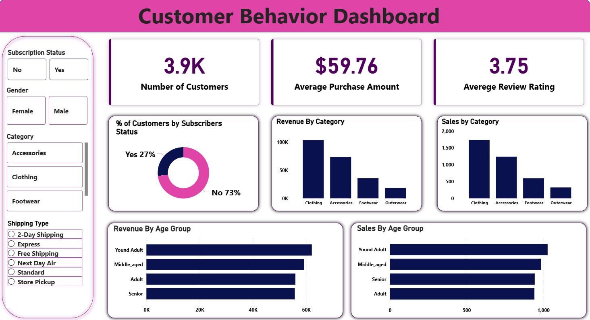

# Customer Behavior Analysis & API


This project demonstrates a complete end-to-end data analytics and machine learning workflow. It includes data processing, exploratory analysis, SQL querying, dashboarding, and a Django REST API for serving ML models.

## 📁 Project Structure

```text
customer_behavior_analysis/
├── api/                        # Django REST API
│   ├── manage.py
│   ├── customer_behavior_django_api/  # Project settings
│   └── ml_models/              # ML endpoints & models
├── data/                       # Dataset (CSV)
├── notebooks/                  # Jupyter Analysis
├── sql/                        # SQL Queries
├── powerbi/                    # Visualization
├── requirements.txt            # Project dependencies
└── README.md                   # This file
```

## 📊 Analytics Workflow

1.  **Data Loading**: Raw data from `data/` is processed using Python.
2.  **EDA**: Exploratory Analysis performed in `notebooks/eda_analysis.ipynb`.
3.  **Data Cleaning**: Preprocessing for both analysis and model training.
4.  **SQL Analysis**: Deep dives into data using scripts in `sql/`.
5.  **Power BI Dashboard**: Interactive visualizations in `powerbi/`.

## 🚀 Machine Learning API

Serve predictions via Django REST Framework.

### Endpoints

- `/segment/` : Customer segmentation
- `/predict/` : Purchase prediction
- `/churn/` : Churn prediction
- `/recommend/` : Product recommendation

### Features

- MLflow integration for model tracking.
- Modular pipeline for training and deployment.

## 🛠 Setup & Installation

1.  **Clone the Repository**

    ```bash
    git clone <repo_url>
    cd customer_behavior_analysis
    ```

2.  **Environment Setup**

    ```bash
    python -m venv .venv
    source .venv/bin/activate  # On Windows: .venv\Scripts\activate
    pip install -r requirements.txt
    ```

3.  **Running the API**

    ```bash
    cd api
    python manage.py migrate
    python manage.py runserver
    ```

4.  **Running Analysis**
    Use Jupyter or run scripts in the `notebooks/` folder.

## 📈 Dashboard Preview



## 📄License

This project is licensed under the MIT License - see the [LICENSE](LICENSE) file for details.
