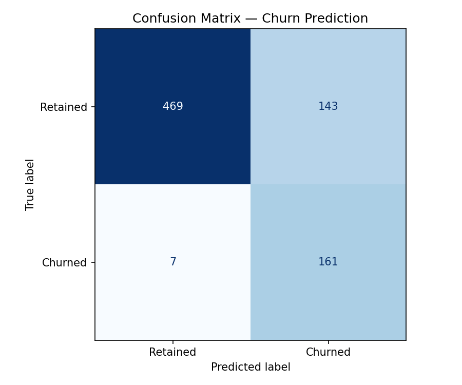
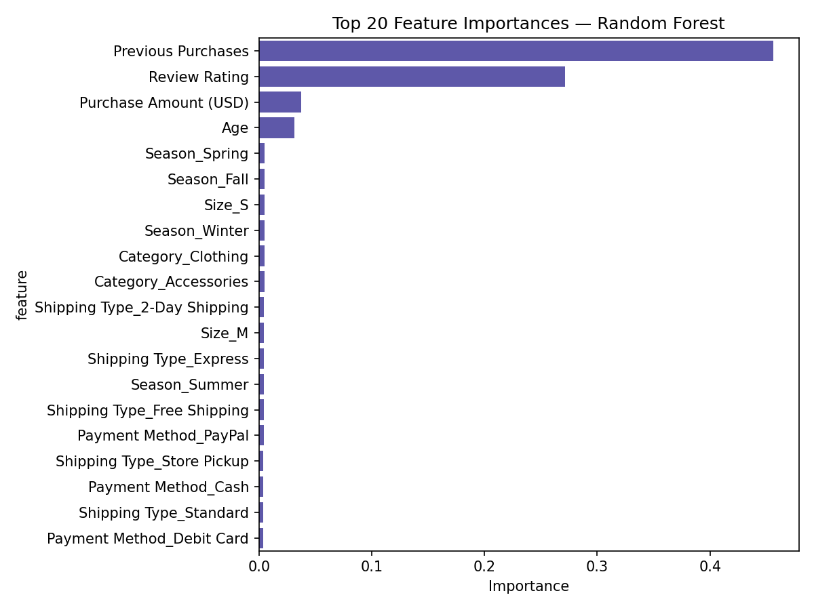
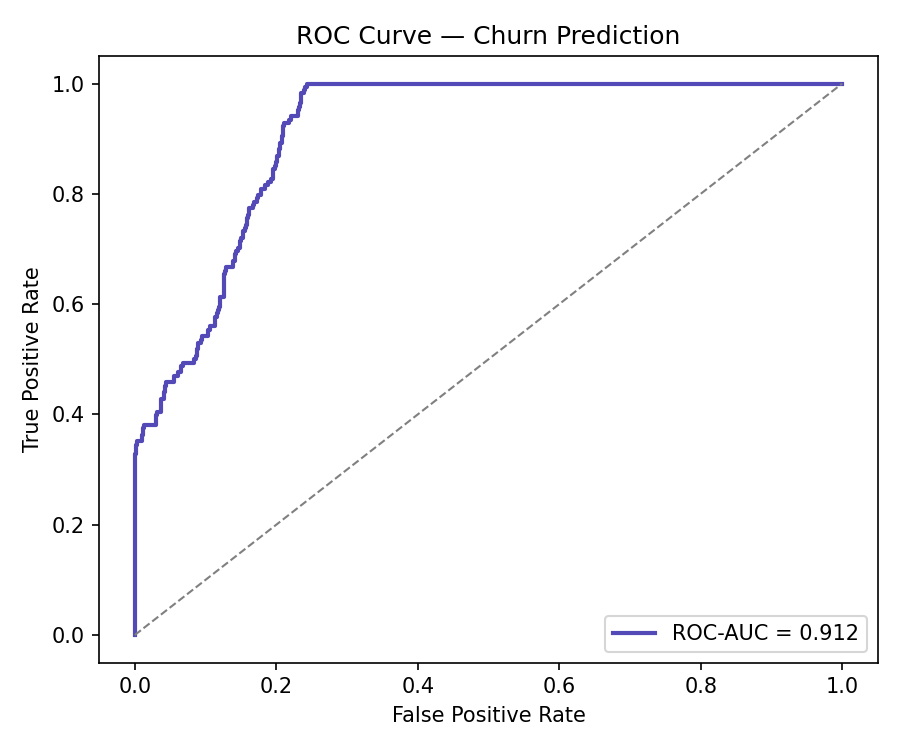

# Customer Behavior Analysis & API

[](LICENSE)
[](https://www.python.org/)
[](https://www.djangoproject.com/)
[](https://jupyter.org/)
[](https://mlflow.org/)
[](https://powerbi.microsoft.com/)
[](https://github.com/toxicbishop/Customer-Behavior-Analysis-Power-BI/actions/workflows/python-test.yml)

This project demonstrates a complete end-to-end data analytics and machine learning workflow. It includes data processing, exploratory analysis, relational SQL querying, star schema modeling, a churn-prediction ML pipeline, and a Django REST API for serving predictions.

## Project Structure

```text
customer_behavior_analysis/
├── .github/
│   └── workflows/                 # CI/CD Automation
│       ├── python-test.yml        # Python Testing CI
│       └── dependency-review.yml  # Dependency Review (PRs)
├── api/                            # Django REST API
│   ├── manage.py
│   ├── customer_behavior_django_api/
│   └── ml_models/                  # ML endpoints & models
├── data/                            # Raw and Processed Datasets
│   ├── raw/                        # Original, unprocessed dataset
│   ├── processed/                  # Star Schema (Fact/Dim tables)
│   └── data-dictionary.md          # Documentation of dataset columns
├── ml/                              # Churn prediction model (Random Forest)
│   ├── train_churn.py
│   └── api_churn.py
├── notebooks/                       # Jupyter Analysis & EDA
│   ├── eda-analysis.ipynb
│   └── analysis.py
├── powerbi/                         # Visualization & Dashboarding
│   ├── customer-behavior-dashboard.pbix   # Main Power BI Report
│   ├── DAX-Measures.md                    # Documentation of analytical logic
│   └── dashboard.png
├── scripts/                         # Utility Scripts (Data Diversification)
│   └── data-diversification.py
├── sql/                             # SQL Scripts (Analysis & Joins)
│   ├── analytical-queries/
│   └── relational-schema/
├── .gitattributes
├── .gitignore
├── LICENSE
├── README.md                        # This file
└── requirements.txt                 # Versioned project dependencies
```

## Analytics Workflow

1. **Data Diversification**: Original CSV (`data/raw/`) is processed via `scripts/data-diversification.py` into a Star Schema.
2. **Relational Modeling**: Clean Dimension (`DIM_Customers`, `DIM_Products`) and Fact (`FACT_Sales`) tables are created in `data/processed/`.
3. **Advanced Analytics**:
   - **Sentiment Analysis**: Integration of customer review data.
   - **Inventory Tracking**: Monitoring stock levels versus purchase frequency.
4. **SQL Relational Analysis**: Complex joins and aggregations in `sql/relational-schema/`, with reusable reporting queries in `sql/analytical-queries/`.
5. **Power BI Dashboard**: Interactive visualizations including WoW growth and high-value customer segments, built on `powerbi/customer-behavior-dashboard.pbix`.

## Machine Learning

Churn prediction is trained and served from `ml/`:

- `ml/train_churn.py` — trains the Random Forest churn model, with MLflow tracking.
- `ml/api_churn.py` — exposes the trained model for inference, wired into the Django API's `/api/churn/` endpoint.

### Model Evaluation Artifacts

- **Confusion Matrix**
  

- **Feature Importance**
  

- **ROC Curve**
  

## Machine Learning API

Serve predictions via Django REST Framework.

### Endpoints

- `/api/segment/` : Customer segmentation
- `/api/predict/` : Purchase prediction
- `/api/churn/` : Churn prediction
- `/api/recommend/` : Product recommendation

### Features

- MLflow integration for model tracking.
- Modular pipeline for training and deployment.
- Automatic testing via GitHub Actions (`python-test.yml`).
- Dependency review on every pull request (`dependency-review.yml`).

## Setup & Installation

1. **Clone the Repository**

   ```bash
   git clone https://github.com/toxicbishop/Customer-Behavior-Analysis-Power-BI.git
   cd Customer-Behavior-Analysis-Power-BI
   ```

2. **Environment Setup**

   ```bash
   python -m venv .venv
   # On Windows: .venv\Scripts\activate
   # On Unix: source .venv/bin/activate
   pip install -r requirements.txt
   ```

3. **Running the API**

   ```bash
   cd api
   python manage.py migrate
   python manage.py runserver
   ```

4. **Training the Churn Model**

   ```bash
   python ml/train_churn.py
   ```

## Dashboard Preview

[](powerbi/dashboard.png)

## License

This project is licensed under the MIT License - see the [LICENSE](LICENSE) file for details.